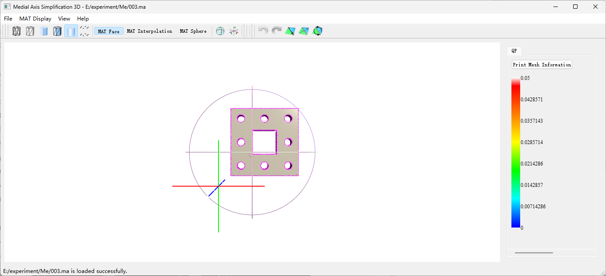

Unzip the MAT.zip, which contains an executable program that can render the medial axis mesh. Drag an .off file into the window, and the program will automatically load the filename.off file (triangular mesh) and the filename.ma file (medial mesh).